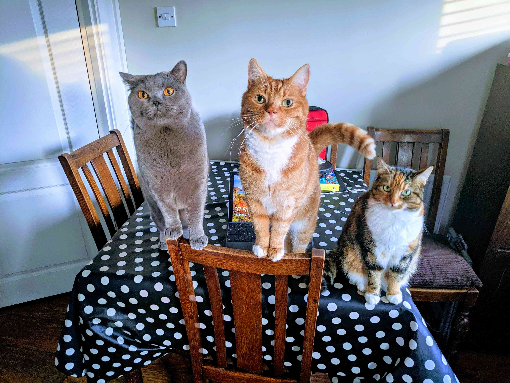

# Gatsby with MDX

# 👋

## Hello MDX

Scott Spence • <span
style={{ color: '#663399' }}>UtkalHacks.tech</span>

<small>March 2021</small>

---

# Scott Spence

<Note>

- Been professional web a developer since 2018
- Analyst Developer 10 years previously
- Large financial organisations Braclays, Fidelity and Deloitte
- I'm married, I have a wife and Daughter and we live in Kent here in
  the UK

</Note>

---



<Note>

- I'm a cat dad...
- That's Boris, Leo and Darcy

</Note>

---


<Note>

- Ok, I work for an ad agency called Karmarama
- And I'm in the Creative Products business unit
- At this point we're pretty much a Government contractor with two
  large scale Gatsby projects in production
- None of which I have worked on or can talk about because, NDA
- I'm not here to talk about any of that
- Sooo, moving on!

</Note>

---

## Progressive Disclosure of Complexity

[jason.af/progressive-disclosure-of-complexity]

[jason.af/progressive-disclosure-of-complexity]:
  https://www.jason.af/progressive-disclosure-of-complexity

<Note>

- In this workshop I'll be going though the different aspects of the
  individual technologies used.
- Then ramping up as I go along.
- Shout out to Jason Lengstorf for introducing me to this concept.
- Let's take a look at the agenda.

</Note>

---

# Agenda

<!-- prettier-ignore-start -->
<Grid
  gridTemplateColumns={["25% ​auto 10% 20%", "25% auto 10% 20%", "25% ​auto 10% 20%"]}
  gridTemplateRows="100%"
  gridTemplateAreas=". main logos ."
>
<Step styles={{
  before: {opacity: 0},
  after:  {opacity: 1, transition: 'all 0.2s ease-out'}
}}
as='Flex' gridArea="main" flexFlow="column nowrap" justifyContent="space-evenly" height="100%"
sx={{'& p': {textAlign: 'left', m: 0, lineHeight: 'small', minHeight: '5%'}}}
>

What is __Markdown__

__What__ is MDX

__Why__ Gatsby

__Build__

</Step>

<Step styles={{
  base:     {height: '5%', transition: 'all 0.2s ease-in-out'},
  before:   {opacity: 0},
  after:    {opacity: 1},
  current:  {transform: 'scale(1.7)'},
}}
as='Flex' gridArea="logos" flexFlow="column nowrap" justifyContent="space-evenly" height="100%"
>


</Step>
</Grid>

<!-- prettier-ignore-end -->

<Note>

- What is Markdown
- What is MDX
- Why Gatsby
- Build a Gatsby site with MDX
- Ok, so - first up!

</Note>

---

# Bonus

<div sx={{display: 'flex'}}>
  
  
  

</div>

GraphCMS with MDX

<Note>

- Bonus round time permitting
- Use GraphCMS blog template for content with MDX components

</Note>

---

# What is Markdown?

# 🤔

<Note>

- If you're not familiar with Markdown it's a way to enable simple
  editing in plain text files that can be converted to HTML.
- fun fact, this presentation is written in Markdown with JSX, more on
  that later though

</Note>

---

<iframe
  src="https://daringfireball.net/projects/markdown/"
  title="Markdown creation"
  width="50%"
  height="50%"
  style={{
    border: 'none',
    transform: 'scale(1.5)',
  }}
/>

<Note>

- Markdown has been around since 2004, here's the original post from
  John Gruber on Daring Fireball

</Note>

---

# Markdown Showdown

Interactive guide: [ss10.dev/mdsd]

[ss10.dev/mdsd]: https://ss10.dev/mdsd

<Note>

- I did a talk on Markdown you can check it out at ss10.dev/mdsd
- Quick example of using Markdown would be

</Note>

---

<CodeHighlight>

```md
# Hello world

This is a paragraph
```

<Note>

- This would be in your text editor
- Then that would render to

</Note>

</CodeHighlight>

---

# Hello world

This is a paragraph

<Note>

- This
- As I mentioned earlier this presentation is written in Markdown
- Ok, next up MDX

</Note>

---

# What is MDX?

# 🤔

<Note>

- MDX is the next step with Markdown
- MDX is Markdown and JSX
- JSX being the HTML elements in React
- It allows you to add interactive components to your documentation

</Note>

---


## [mdxjs.com/conf]

[mdxjs.com/conf]: https://mdxjs.com/conf

<Note>

- Last year was the first MDX conf
- Check out MDX conf

</Note>

---

# Why Gatsby

<Note>

- Gatsby _is_ a static site generator, so there's no dynamic
  generation of pages when the pages are requested. The built output
  for a Gatsby site can be hosted on a CDN making it globally
  available and super scalable.
- Gatsby can use Markdown files to create pages in a site project.
  Gatsby will read the Markdown files into the Gatsby filesystem and
  transform the Markdown to HTML and then when building the site
  create static pages.
- The end result is a super fast site with little latency when
  requesting the pages.

</Note>

---

# Build

<Note>

- I'm going to build a Gatsby blog now

</Note>

---

<CodeHighlight>

## Install dependencies!

```bash
#  bash
yarn add gatsby react react-dom
```

<Note>

- First up to install what I need to get started

</Note>

</CodeHighlight>

---

<CodeHighlight>

## Create files and folders!

```bash
# -p is to create parent directories too if needed
mkdir -p src/pages
# create the index (home) page
touch src/pages/index.js
```

<Note>

- Now to create the basic files structure for the project
- Note `src/pages/index.js` is the Gatsby folder structure

</Note>

</CodeHighlight>

---

<CodeHighlight>

## Create files and folders!

```jsx
// index.js
import React from 'react'

export default function IndexPage() {
  return <h1>Hello World!</h1>
}
```

<Note>

- Now I'll add in the site index page

</Note>

</CodeHighlight>

---

<CodeHighlight>

## Run Gatsby develop!

```bash
# if you're using npm 👇
# $(npm bin)/gatsby develop
yarn gatsby develop
```

<Note>

- yarn gatsby develop to run from the terminal without npm
- I'll add in some scripts next

</Note>

</CodeHighlight>

---

<CodeHighlight>

## Create content files for the blog!

```bash
# this creates the folders in the root of the project
mkdir -p content/2021/03/{06/hello-world,07/second-post,08/third-post}
# create individual files
touch content/2021/03/06/hello-world/index.mdx
touch content/2021/03/07/second-post/index.mdx
touch content/2021/03/08/third-post/index.mdx
```

<Note>

- Create .mdx files from the terminal
- Becuse watching someone do it isn't very entertaining

</Note>

</CodeHighlight>

---

<CodeHighlight>

## Add content!

```markdown
---
title: Hello World - from mdx!
date: 2021-03-06
---

My first post!!

## h2 Heading

Some meaningful prose

### h3 Heading

Some other meaningful prose
```

<Note>

- I'll add the content for the other files too
- Note the frontmatter block `---` this is the data about the post

</Note>

</CodeHighlight>

---

<CodeHighlight>

## Create Gatsby config

```bash
touch gatsby-config.js
# add required Gatsby plugins
yarn add gatsby-plugin-mdx @mdx-js/mdx @mdx-js/react gatsby-source-filesystem
```

<Note>

- Create the Gatsby config file to take the plugins
- Install the plugins needed

</Note>

</CodeHighlight>

---

<CodeHighlight>

## Add npm scripts!

```json
// package.json
"scripts": {
  "build": "gatsby build",
  "dev": "gatsby develop",
  "serve": "gatsby serve",
  "clean": "gatsby clean"
},
```

<Note>

- yarn gatsby develop to run from the terminal without npm
- I'll add in some scripts next

</Note>

</CodeHighlight>

---

---

---

---

# GraphCMS with MDX

---

# Let's talk about MDX

<Note>

- Just a little more time to talk about MDX
- and how awesome it is
- This presentation is made with MDX
- I recall the first time I discovered MDX for a presentation
  - Sara Viera at Vue Conf London 2018
- Being a blogger/digital gardener/thought pamphlet author this really
  useful
- Why is it useful?
- MDX allows for the addition of JSX to Markdown, so React components
  in your documentation.
- MDX is a great tool for making interactive documentation no doubt
  you have seen sites like Josh Comeau's site which is jam packed with
  whimsy features powered by MDX

</Note>

---

<Callout variant="info">
  <a href="https://www.joshwcomeau.com/react/folding-the-dom/">
    joshwcomeau.com/react/folding-the-dom
  </a>
</Callout>

<Note>

- This was one of the first real world implementations of MDX in a
  site I found
- this blew my mind!
- Lets check it out quickly

</Note>

---

# 🤯

<Note>

- This led me down the path of wanting to incorporate MDX into my site
- And everthing else, see the slides title

</Note>

---


## [mdx-embed.com]

[mdx-embed.com]: https://mdx-embed.com/

<Note>

- I'm on the MDX Embed core team
- MDX Embed is pretty neat, it soon came to light that I wanted this
  for all the Tweets and YouTube videos I wanted to embed in my site
- MDX Embed means embedding things like

</Note>

---

<Tweet
  tweetLink="jack/status/20"
  align="center"
  hideConversation={true}
/>

<Note>

- Tweets

</Note>

---

<CodePen codePenId="PNaGbb" tabs={['html', 'result']} />

<Note>

- CodePen's

</Note>

---

<YouTube youTubeId="W3Ixy4B1AaQ" />

<Note>

- And YouTube's

</Note>

---

## MDX Gatsby Plugin

```bash
npm install gatsby-plugin-mdx @mdx-js/mdx @mdx-js/react
```

<Note>

- Ok let's look at what we need to do to get set up with MDX in a
  Gatsby project

</Note>

---

## MDX Embed Gatsby Plugin

```bash
npm install mdx-embed gatsby-plugin-mdx-embed
```

<Note>

- FYI you can also add in MDX Embed at this point too

</Note>

---

<CodeHighlight>

```js {2}
module.exports = {
  siteMetadata,
  plugins: [
    // all other gatsby plugins
    {
      resolve: `gatsby-plugin-mdx`,
      options: {
        extensions: [`.mdx`, `.md`],
      },
    },
  ],
}
```

<Note>

- Fun fact you don't explicitly have to define the file types, I
  discodered this on a live stream with James Q Quick
- The extension was wrong but still imported the files

</Note>

</CodeHighlight>

---

<CodeHighlight>

```js {7}
{
  resolve: `gatsby-plugin-mdx`,
  options: {
    extensions: [`.mdx`, `.md`],
    gatsbyRemarkPlugins: [
      `gatsby-remark-copy-linked-files`,
      `gatsby-remark-assets`,
    ],
  },
},
```

<Note>

- You can also add in any Remark Plugins you might want as well

</Note>

</CodeHighlight>

---

<CodeHighlight>

```js {4}
{
  resolve: `gatsby-source-filesystem`,
  options: {
    path: `${__dirname}/content/`,
    name: `content`,
  },
},
```

<Note>

- I won't pretend to know how any of it works I'm ok with abstractions

</Note>

</CodeHighlight>

---

<CodeHighlight>

```jsx {3}
export const wrapPageElement = ({ element }) => (
  <MDXProvider components={components}>
    <Layout>{element}</Layout>
  </MDXProvider>
)
```

<Note>

- High up in the component tree you need to wrap your MDX components
  in the MDXProvider
- This can be added to the gatsby-prowser and gatsby-ssr files

</Note>

</CodeHighlight>

---

<CodeHighlight>

```js
import { wrapPageElement as wrap } from './src/root-wrapper'

export const wrapPageElement = wrap
```

<Note>

- Or you can create on file and import that into the two files, both
  work but you're only maintaining one file the other way

</Note>

</CodeHighlight>

---

# Fin

<Note>

- This was the section where I was meant to talk about integrating MDX
  into NextJS
- Unfortunately I have run out of time on the slides for this, so I
  apologise for that

</Note>

---

<Tweet
  tweetLink="bradgarropy/status/1352472699520610304"
  align="center"
  hideConversation={true}
/>

---

<Tweet
  tweetLink="spences10/status/1360694044305801216"
  align="center"
  hideConversation={true}
/>

---

<Tweet
  tweetLink="leeerob/status/1360746843785805830"
  align="center"
  hideConversation={true}
/>

---

# Thanks 🙏
